# iOS 学生管理系统

## 项目简介
这是一个基于 Swift 的 iOS 应用程序，旨在为学生和教师提供一个管理学生课程、成绩和个人信息的便捷平台。该应用程序包含多个模块，支持学生和教师的不同功能需求。


## 功能模块

### 登陆界面
可以选择学生端和教师端登录
<p>
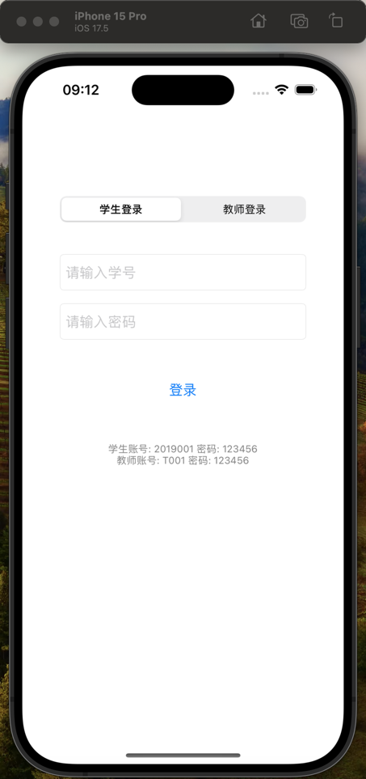
</p>


### 学生功能
- **课程管理**：查看已选课程和课程详情。
<p align="center">
  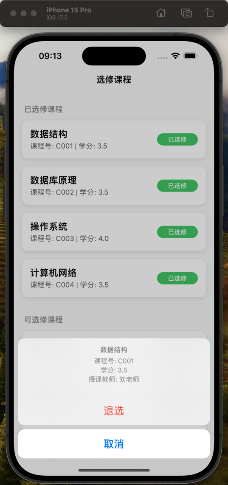
  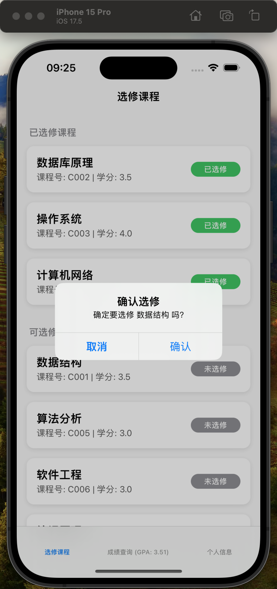
  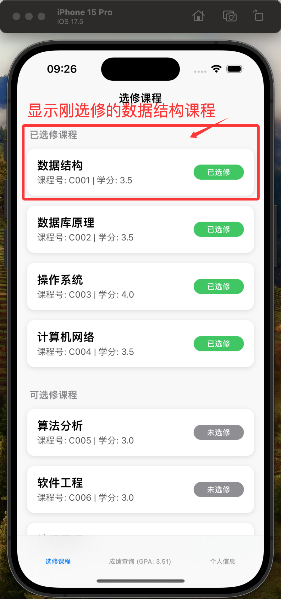
</p>

- **成绩查询**：查看各科成绩。
- **个人信息**：查看和更新个人资料。
<p align="center">
  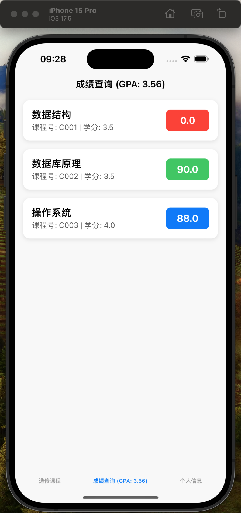
  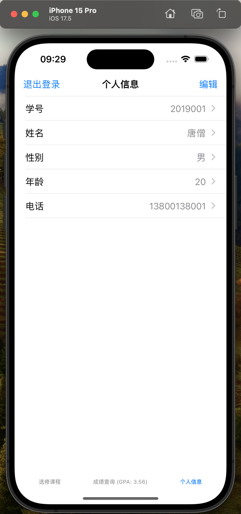
</p>


### 教师功能
- **课程管理**：管理课程和学生选课。
<p align="center">
  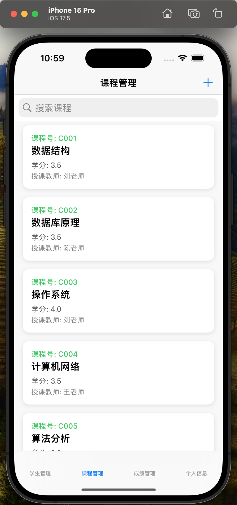
  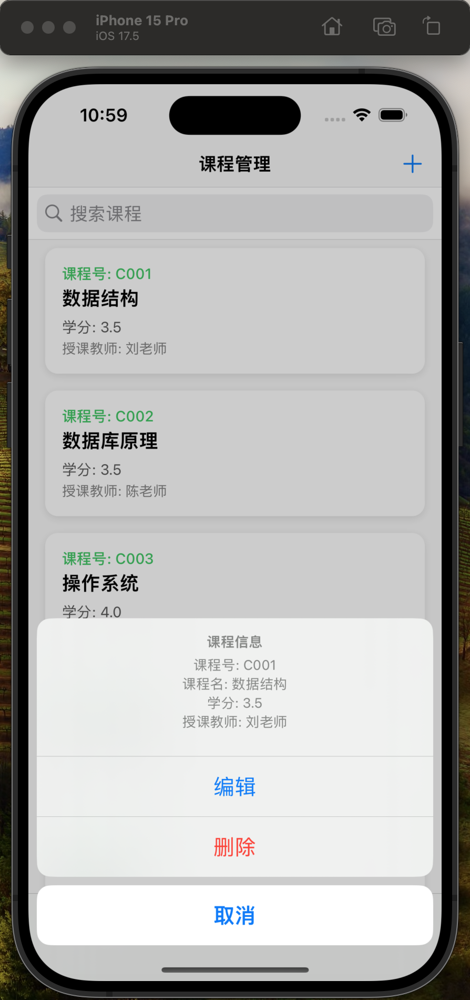
  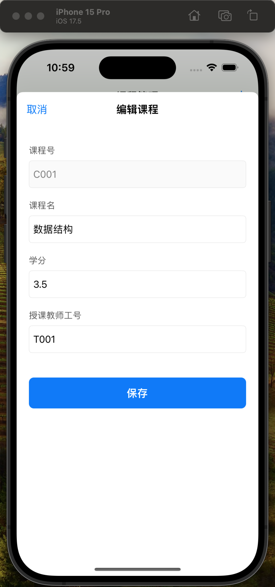
</p>

- **学生管理**：查看学生信息和成绩。
<p align="center">
  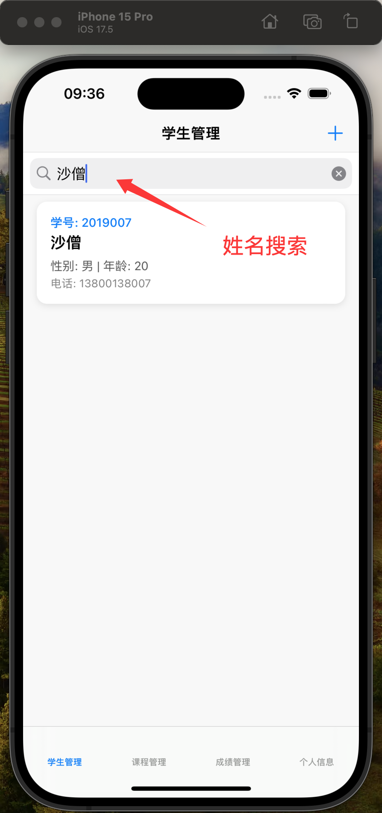
  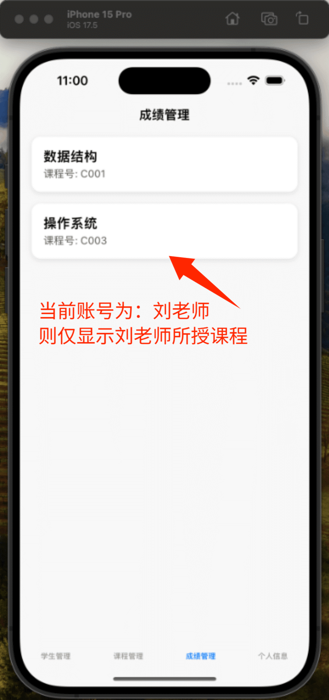
</p>
<p align="center">
  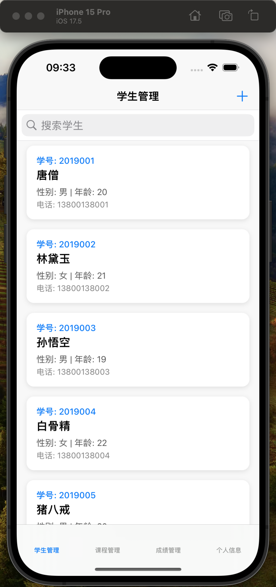
  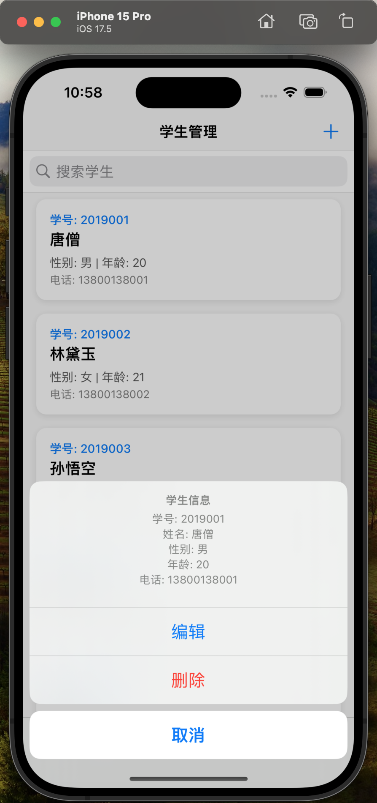
  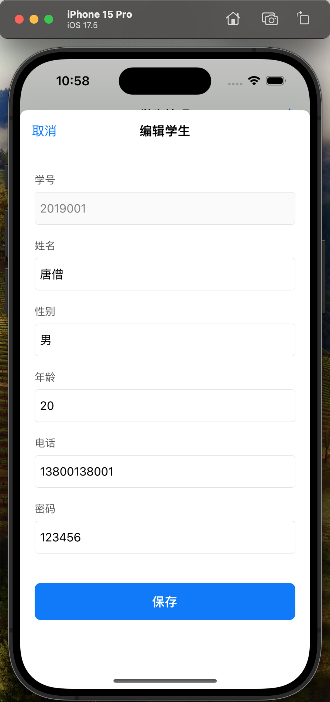
</p>
<p align="center">
  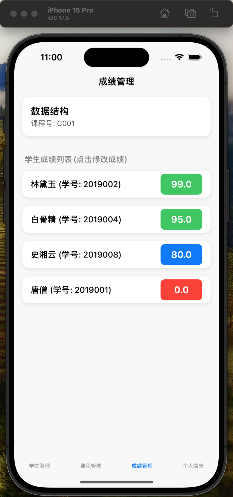
  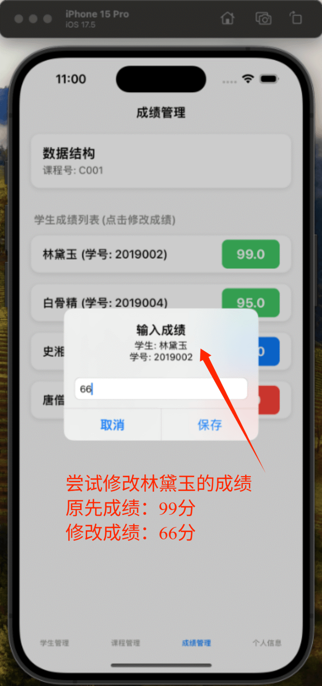
  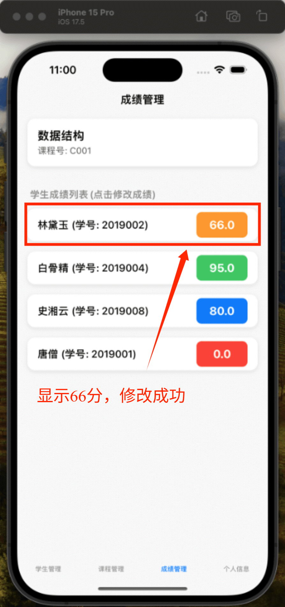
</p>


## 项目结构

### 文件夹结构
- `Controllers/`：包含所有视图控制器，例如 `StudentViewController.swift` 和 `TeacherTabBarController.swift`。
- `Models/`：包含数据模型，例如 `Student.swift` 和 `Course.swift`。
- `Assets.xcassets/`：存储应用程序的资源文件，如图标和颜色。
- `Base.lproj/`：包含应用程序的界面文件，如 `Main.storyboard` 和 `LaunchScreen.storyboard`。

### 主要文件
- `AppDelegate.swift`：应用程序的入口，负责初始化应用程序。
- `SceneDelegate.swift`：管理应用程序的场景生命周期。
- `ViewController.swift`：主视图控制器。

## 环境要求
- **操作系统**：macOS
- **开发工具**：Xcode
- **编程语言**：Swift
- **最低支持 iOS 版本**：iOS 14.0

## 安装与运行

1. 克隆项目到本地：
   ```bash
   git clone https://github.com/GeometryFu/Student-Course-Selection-System-iOS-Application
   ```

2. 打开项目：
   ```bash
   open app.xcodeproj
   ```

3. 在 Xcode 中选择模拟器或真机运行项目。
